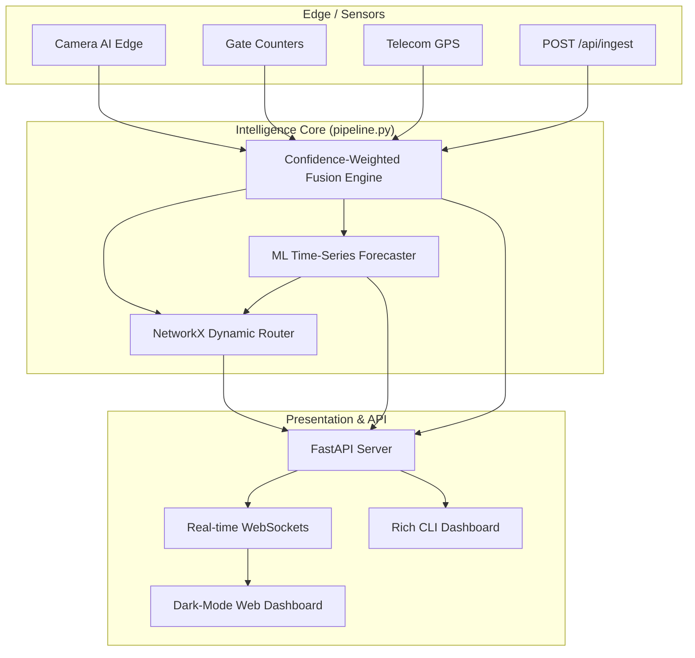

# Simhastha 2028: Intelligent Crowd Flow & Route Optimization

A live, modular, AI-driven pipeline designed for massive-scale crowd-flow prediction and route optimization for the Simhastha Ujjain 2028 festival (similar to Mahakumbh). 

This solution addresses the critical operational challenge of managing millions of pilgrims by providing **real-time monitoring, machine-learning-based forecasting, dynamic route optimization, and live congestion alerts**.

---

## 🌟 The Problem & Our Novel Solution

**The Challenge:** Massive religious gatherings attract millions, leading to dangerous crowd congestion, stamped risks, and operational chaos at ghats, temples, and transit hubs. Authorities need to monitor, predict, and optimize crowd movement in real-time.

**Our Novelty:** We move beyond static dashboards by building a **live simulation and intelligence engine**. 
1. **Sensor Fusion:** We ingest signals from multiple disparate sources (CCTVs, Gate Counters, GPS, QR Scanners) and fuse them using *confidence-weighted averaging*.
2. **AI Forecasting:** We use a Multi-output Random Forest Regressor trained on 370k+ synthetic simulations to predict crowd surges 15 and 30 minutes *before* they happen.
3. **Dynamic Graph Routing:** Using `NetworkX`, our engine actively penalizes congested paths and instantly reroutes pilgrims around manually closed gates.
4. **Zero-Downtime:** The ML forecaster has an intelligent fallback to an Exponential Moving Average (EMA) to ensure the API never fails during a crisis.

---

## 🏗️ Architecture Diagram



---

## 🚀 Core Logic & Technology Stack

**Tech Stack:** `Python 3.11`, `FastAPI`, `scikit-learn` (Random Forest), `NetworkX` (Dijkstra), `WebSockets`, `rich` (CLI UI), `vis-network` (Frontend), `Docker` / `uv`.

### 1. Confidence-Weighted Sensor Fusion
Physical sensors fail. Cameras get occluded by heavy rain, and gate counters miscount during surges. Our `FusionEngine` takes the `confidence` score of every incoming sensor payload, adjusts it dynamically based on the active `weather` scenario, and computes a highly accurate weighted mathematical average of the true node occupancy.

### 2. Time-Series Machine Learning Forecaster
We engineered a `RandomForestRegressor` that acts as a Time-Series predictor. It tracks the rolling window of the last 5 occupancy lags (historical ticks) and encodes the active scenario (e.g., *shahi_snan*) and weather (e.g., *heavy_rain*). It accurately infers the expected occupancy 15-minutes and 30-minutes into the future. 
*(Graceful Degradation: If the model is missing, it falls back to an Exponential Moving Average).*

### 3. Dynamic Route Optimization
The system loads a physical map of Ujjain into a `NetworkX` directed graph. As node occupancies reach CRITICAL limits (load > 100%), the edge weights leading to those nodes are dynamically penalized. The `router.py` uses Dijkstra's algorithm to compute the safest, least-congested route for pilgrims in real-time.

---

## 📂 Detailed File Structure

```text
simhastha-crowd-intelligence/
├── api/                    # Presentation Layer
│   ├── static/             # Vanilla JS/HTML Premium Web Dashboard
│   └── server.py           # FastAPI REST & WebSocket server
├── config/                 # Centralized physics constants & base capacities
├── fusion/                 # Occupancy confidence-weighted fusion engine
├── graph/                  # Dynamic NetworkX graph construction
├── ingestion/              # Data source providers (dummy simulators)
├── models/                 # Serialized scikit-learn models (forecaster.pkl)
├── optimization/           # Route optimization (Dijkstra) and congestion alerts
├── prediction/             # ML Forecasting & EMA fallback logic
├── scripts/                # ML Pipeline scripts
│   ├── generate_training_data.py  # Rapidly simulates ticks to generate CSV
│   └── train_ml_model.py          # Trains the Multi-output Random Forest
├── tests/                  # Pytest test suite for core logic validation
├── Dockerfile              # Hugging Face Spaces ready Dockerfile (port 7860)
├── pipeline.py             # Main orchestrator & Rich CLI dashboard
├── pyproject.toml          # uv project configuration
└── README.md               # You are here!
```

---

## 🔌 API & Webhook Integration

The backend is fully equipped to talk to actual hardware in the real world.

- **`POST /api/ingest`**: Real-time webhook ingestion for physical IoT/CCTV edge devices.
  ```json
  {
    "node_id": 5,
    "source_type": "Camera AI",
    "estimate": 12500,
    "confidence": 0.88
  }
  ```
- **`GET /api/nodes`**: Fused state of all 25 nodes.
- **`GET /api/graph`**: Full dynamic graph (nodes + edges).
- **`GET /api/alerts`**: Active HIGH/CRITICAL congestion alerts.
- **`GET /api/routes?from=16&to=5`**: Safest path computation between two nodes.
- **`GET /api/diversions`**: Top-N recommended diversions.
- **`POST /api/scenario`**: Dynamically change scenario/weather state at runtime.
- **`WS /ws`**: Live WebSocket state stream for the frontend dashboard.

---

## 🛠️ Setup & Deployment

### Local Development
This project is managed with `uv` for lightning-fast dependency management.
```bash
uv sync
uv run python pipeline.py
```

### Hugging Face Spaces (Docker)
The system is heavily optimized for zero-config deployment to a Hugging Face **Docker Space**.
1. Create a New Space on Hugging Face.
2. Select **Docker** -> **Blank** template.
3. Push this repository to the Space.
4. Hugging Face will automatically use the provided `Dockerfile`, expose port `7860`, and boot the FastAPI backend + static frontend automatically!

Access the live dashboard at the URL provided by your Hugging Face Space.